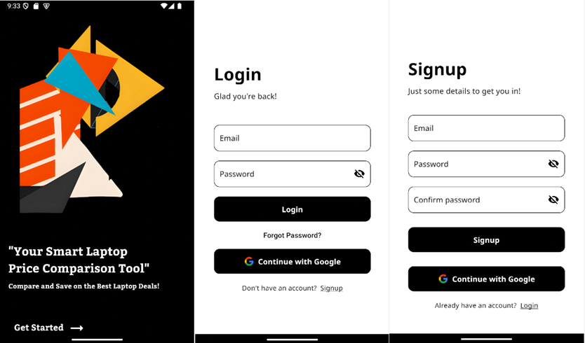
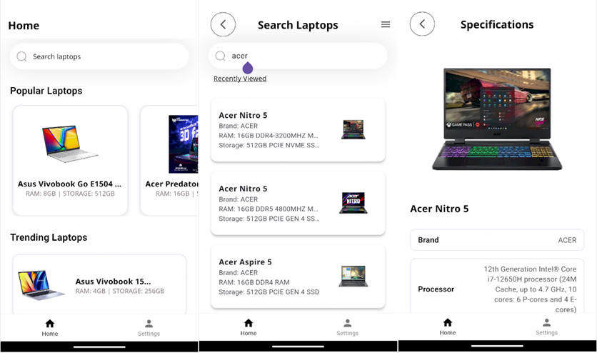
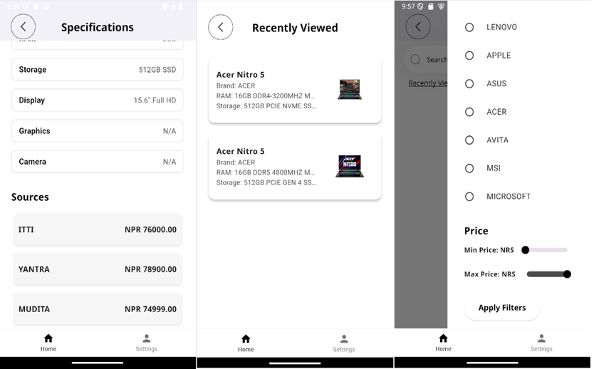

# PriceCheck Nepal

A Flutter application to help users compare prices of tech items across various e-commerce platforms in Nepal. PriceCheck Nepal is designed to make shopping easier, saving time and money by providing a centralized platform for price comparison.

---

Screenshots





---

## Features

- 🛒 **Compare prices** of tech items from multiple e-commerce platforms in Nepal.
- 🔍 **Frequent updates** to ensure accurate and up-to-date prices.
- 📊 **Analytics for subscribers** (future feature).
- 🌐 **User-friendly interface** built with Flutter.

---

## Installation

### Prerequisites

- [Flutter](https://docs.flutter.dev/get-started/install) (ensure it's installed and configured on your machine)
- Android/iOS emulator or a physical device for testing

### Steps

###### 1. Clone the repository:

```bash
git clone https://github.com/TinySkillet/PriceCheckNepal.git
cd price_check_np
```

###### 2. Install dependencies

```bash
flutter pub get
```

###### 3. Run the app:

```bash
flutter run
```

### Target Audience

The app is ideal for:

- Students, professionals, and tech enthusiasts looking to purchase laptops, phones, and other gadgets.
- Users seeking the best deals across multiple e-commerce platforms in Nepal.

**PriceCheck Nepal** currently compares laptop prices from **three** different e-commerce websites: **ITTI, Mudita** and **Yantra Nepal**. The data is scraped using our Python-based **WebScraper** and laptop prices are updated at the end of each week.

We plan to upgrade the WebScraper by transitioning to **Go** and incorporating goroutines in the future.
